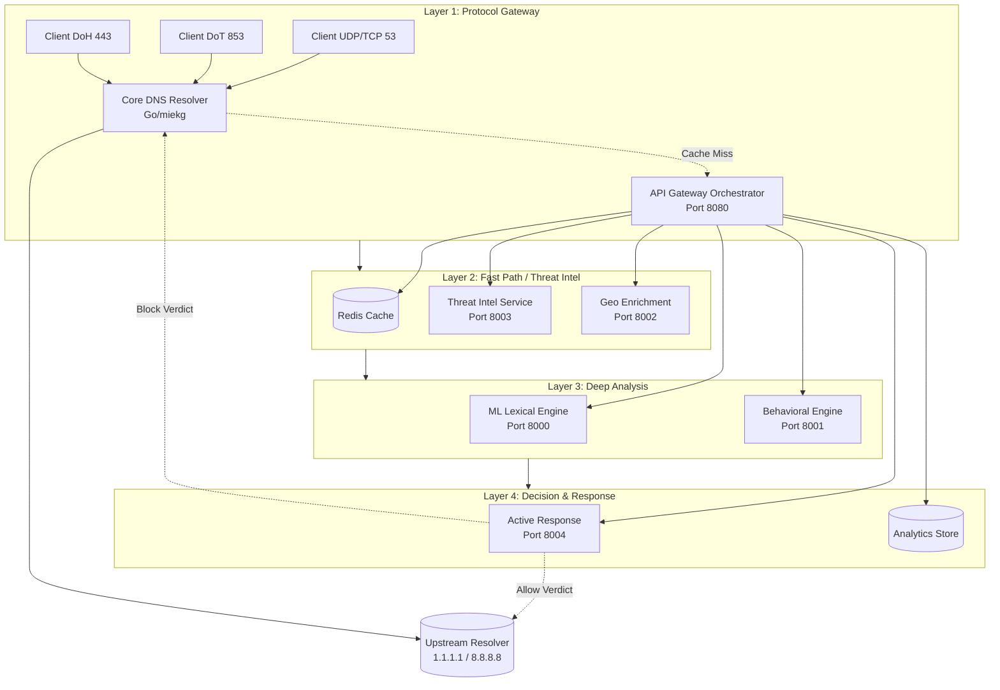

# DNS Shield — System Architecture

> **Version**: 2.0  
> **Last Updated**: 2026-08-20  
> **Status**: `[IMPLEMENTED ✅]` Architecture topology and synchronous orchestrator. Active response enforcement is `[LAB SIMULATED 🔬]`.

## 1. High-Level Topology (4-Layer Model)

DNS Shield operates as an inline, synchronous security perimeter. It does not rely on passive SPAN port tapping; it is in the critical path for DNS resolution.

---

## 2. Component Specifications & Failure Modes

The system is designed to **fail open**. If a security service crashes, resolution continues (degraded), ensuring the network does not go down.

### Layer 1: Protocol Gateway (Resolver Core)
- **Port Bindings**: UDP/TCP 53, TCP 853 (TLS), TCP 443 (HTTPS)
- **Tech Stack**: Go (`miekg/dns`), Nginx for TLS termination
- **TLS Termination**: Terminated locally at the resolver proxy before inspection.
- **Failure Mode**: If the Go resolver dies, local devices lose DNS. (Must be deployed as a highly-available pair via VRRP/Keepalived).
- **Fallback**: If the API Gateway orchestrator times out (>100ms), the resolver **fails open** and resolves the query via upstream without inspection.

### Layer 2: Fast Path (Caching & Threat Intel)
- **Port Bindings**: Redis (6379), Threat Intel (8003), Geo (8002)
- **Tech Stack**: Python FastAPI, Redis Bloom Filter, MaxMind GeoLite2
- **Failure Mode**: If Redis dies, every query triggers full ML/Intel evaluation (latency spikes).
- **Fallback**: API Gateway falls back to local in-memory LRU cache if Redis is unreachable. If Threat Intel is down, system relies purely on ML.

### Layer 3: Deep Analysis (Machine Learning & Behavioral)
- **Port Bindings**: ML Inference (8000), Behavioral (8001)
- **Tech Stack**: Scikit-Learn (Random Forest), joblib, Redis (Sliding windows)
- **Failure Mode**: If ML service dies, unknown zero-day domains cannot be scored.
- **Fallback**: API Gateway catches `503 Service Unavailable`, logs the error, and applies `ALLOW` verdict based solely on Threat Intel blocklists.

### Layer 4: Decision & Active Response
- **Port Bindings**: Active Response (8004), Analytics (8005)
- **Tech Stack**: Python, ClickHouse/PostgreSQL (simulated by Redis for lab)
- **Failure Mode**: If Analytics store dies, queries are processed and returned, but telemetry is dropped.
- **Fallback**: Asynchronous fire-and-forget logging. Analytics failure never blocks the critical DNS resolution path.

---

## 3. Deployment Firewall Enforcements

For DNS Shield to be effective in an enterprise, standard DNS bypass must be blocked at the perimeter firewall:

| Rule Name | Action | Source | Destination | Protocol | Port | Description |
|---|---|---|---|---|---|---|
| `ALLOW_DNS_SHIELD_OUT` | **ALLOW** | DNS Shield Node | Any | UDP/TCP | 53, 853, 443 | Allow the Shield to query upstream (1.1.1.1, 9.9.9.9) |
| `BLOCK_ROGUE_DNS_53` | **DROP** | Any Internal | Any External | UDP/TCP | 53 | Prevent endpoints from bypassing the Shield via standard DNS |
| `BLOCK_ROGUE_DOT_853` | **DROP** | Any Internal | Any External | TCP | 853 | Prevent DNS-over-TLS bypass |
| `BLOCK_KNOWN_DOH_IPS` | **DROP** | Any Internal | Known DoH IPs | TCP | 443 | Prevent DoH bypass (requires maintaining a list of public DoH provider IPs) |

---

## 4. Shared Modules & Libraries

### `dns_shield_features.py`
Located at project root. Used by both `ml-training` and `services/ml-inference`.
- **Why it is separate**: `joblib` serializes `FunctionTransformer` by reference to function name + module. If defined in `train.py`'s `__main__`, it fails to unpickle in the inference service. A standalone module resolves identically in both environments.

### `domain_mutations.py`
Used for adversarial ML evaluation. Modifies raw domain strings to test model resilience against evasion tactics.

---

> **Note on Fail-Closed capability**: Some high-security environments require **fail-closed** (block all resolution if ML is offline). This is a `[PLANNED 🗺️]` configuration toggle in `api-gateway`.
