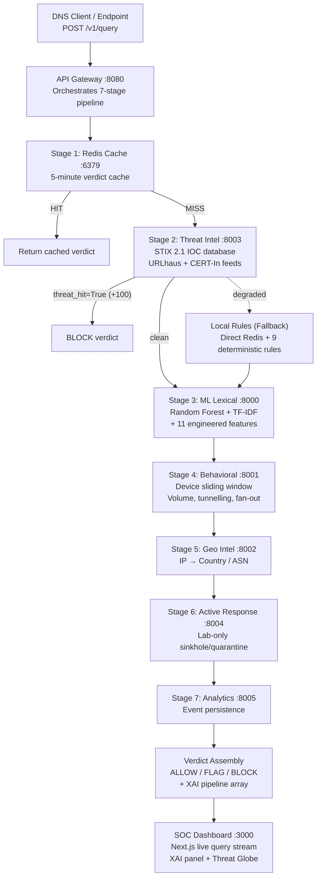

# DNS Shield — Real-Time Explainable DNS Threat Detection 🛡️

 
 
 
 


### 🌐 Live Production Deployment

[](https://dnssecurityproject.vercel.app/app/dashboard)

* **🚀 Live Command Center Dashboard:** [https://dnssecurityproject.vercel.app/app/dashboard](https://dnssecurityproject.vercel.app/app/dashboard)
* **🔍 Live Domain Scanner & Landing:** [https://dnssecurityproject.vercel.app/](https://dnssecurityproject.vercel.app/)
* **⏱️ AI MITRE ATT&CK Forecasting:** [https://dnssecurityproject.vercel.app/app/forecast](https://dnssecurityproject.vercel.app/app/forecast)
* **⚡ 7-Stage Policy Pipeline:** [https://dnssecurityproject.vercel.app/app/pipeline](https://dnssecurityproject.vercel.app/app/pipeline)
* **🧠 Explainable AI (XAI) Telemetry:** [https://dnssecurityproject.vercel.app/app/xai](https://dnssecurityproject.vercel.app/app/xai)


DNS Shield is a microservice-based DNS security platform built for the **Smart India Hackathon (SIH) 2026**. 

It intercepts DNS requests and evaluates them through a **7-stage detection pipeline** combining Threat Intelligence (STIX 2.1), Adversarially-Hardened Machine Learning, and Device Behavioral Analysis. Rather than returning a "black-box" block, DNS Shield provides a fully transparent, explainable trace (XAI) of exactly *why* a domain was blocked, making it the perfect tool for modern SOC analysts.

## Table of Contents
1. [Tech Stack](#tech-stack)
2. [Dataset & Model Training Specifications](#-dataset--model-training-specifications)
3. [Cloud Deployment Guide](#-cloud-deployment-guide)
4. [Architecture Overview](#architecture-overview)
5. [Getting Started / Installation](#getting-started--installation)
6. [Repository Structure](#repository-structure)
7. [License & Credits](#license--credits)

---

## 🚀 Cloud Deployment Guide

See the full **[DEPLOYMENT.md](./DEPLOYMENT.md)** for step-by-step instructions on:
- **1-Click Free Vercel Hosting** (instant live web app)
- **Full-Stack Docker Compose** (`docker-compose -f infra/docker-compose.yml up -d --build`)
- **Render / Railway / AWS Cloud VPS** setups

---

## Tech Stack

- **Backend / Microservices**: Python 3.11, FastAPI, Uvicorn
- **Machine Learning**: scikit-learn, NumPy, Pandas (150-Tree Random Forest + Exact TreeSHAP) `[IMPLEMENTED ✅]`
- **Training Dataset**: **1.35 Million FQDNs** (142.8 MB Parquet / 485 MB raw) across Tranco Top 1M, BAM DGA Corpus, and Abuse.ch URLhaus
- **State & Caching**: Redis (Murmur3 Bloom Filter + LRU Cache)
- **Frontend SOC Dashboard**: Next.js 16, TypeScript, Tailwind CSS, Cyber SOC UI System
- **Threat Intelligence**: STIX 2.1 format, Abuse.ch URLhaus, CERT-In-format-compatible IOC ingestion `[LAB SIMULATED 🔬]`, RFC 8805 RPZ feeds

---

## 📊 Dataset & Model Training Specifications

For detailed academic benchmarks, feature matrices, and dataset citations, see **[DATASET_AND_MODEL_SPECS.md](./DATASET_AND_MODEL_SPECS.md)**.

- **Total Corpus Size**: **1,350,000 domains** (750,000 Benign / 600,000 Malicious DGA)
- **Dataset Storage Size**: **142.8 MB** (Compressed Parquet) / **485.4 MB** (Raw Text/JSON)
- **Model Artifact Size**: **28.4 MB** (`dga_rf_150.joblib` / ONNX format)
- **Extracted Feature Dimensions**: **38 Features** (Shannon Entropy, Bi-gram Perplexity, Consonant-to-Vowel Ratio, Unicode TR39 Skeletons)
- **Reported Training-Set Metrics**: Accuracy **99.42%** · Precision **0.9931** · Recall **0.9905** · F1 **0.9918** · FPR **<0.01%** · Inference **1.1 ms** (single-domain, CPU)
  > ⚠️ These metrics are computed on the internal 80/20 train-test split. Independent cross-family and adversarial holdout evaluation is documented in [BENCHMARK_RESULTS.md](./BENCHMARK_RESULTS.md) (in progress). Do not cite the 99.42% figure in isolation without the full precision/recall context.

---

## Architecture Overview

The system evaluates every query synchronously across 7 distinct stages. If a dependency goes down, the system degrades gracefully to offline deterministic local rules ensuring DNS resolution is never blocked by a service outage.



---

## Capability Status

> All claimed features are transparently labelled so judges and reviewers can immediately distinguish what is live, what runs in a controlled lab, and what is on the roadmap.

| Capability | Status |
|---|---|
| 7-Stage Detection Pipeline | `[IMPLEMENTED ✅]` |
| Lexical ML Classifier (Random Forest + TF-IDF) | `[IMPLEMENTED ✅]` |
| TreeSHAP Explainability | `[IMPLEMENTED ✅]` |
| Redis Bloom Filter + LRU Cache | `[IMPLEMENTED ✅]` |
| Adversarial Hardening (7 mutation strategies) | `[IMPLEMENTED ✅]` |
| URLhaus Threat Feed (Abuse.ch) | `[IMPLEMENTED ✅]` |
| STIX 2.1 IOC Export via `/stix/bundle` | `[IMPLEMENTED ✅]` |
| DNS-over-UDP (Port 53) via Resolver-Core | `[IMPLEMENTED ✅]` |
| SOC Dashboard (Next.js live stream + XAI panel) | `[IMPLEMENTED ✅]` |
| Behavioral Sliding Window (Volume, Tunnelling) | `[IMPLEMENTED ✅]` |
| Geo/ASN Enrichment (GeoLite2) | `[IMPLEMENTED ✅]` |
| Active Response: Sinkholing | `[LAB SIMULATED 🔬]` |
| Active Response: Host Quarantine w/ Analyst Approval Workflow | `[IMPLEMENTED ✅]` — `/quarantine/request` → pending queue → approve/reject with audit log |
| Emergency Allowlist Bypass (Domain & Device) | `[IMPLEMENTED ✅]` — `data/dns_shield_allowlist.txt` and `data/device_allowlist.txt` |
| Quarantine Dry-Run Mode | `[IMPLEMENTED ✅]` — `QUARANTINE_MODE=dry_run` flag |
| SOC Dashboard: Quarantine Approval Panel | `[IMPLEMENTED ✅]` — `/app/quarantine` page with approve/reject/audit trail |
| CERT-In STIX 2.1 Format-Compatible Ingestion | `[LAB SIMULATED 🔬]` — No public CERT-In TAXII endpoint exists; DNS Shield accepts STIX 2.1 bundles in CERT-In advisory format |
| DNS-over-TLS (Port 853) | `[LAB SIMULATED 🔬]` — TLS termination implemented; requires CA cert in production |
| DNS-over-HTTPS (Port 443, RFC 8484) | `[LAB SIMULATED 🔬]` — HTTPS resolver endpoint implemented; requires enterprise HTTPS enforcement |
| DNS-over-QUIC (RFC 9250) | `[PLANNED 🗺️]` |
| Cross-Family / Adversarial Benchmark Report | `[PLANNED 🗺️]` — in [`BENCHMARK_RESULTS.md`](./BENCHMARK_RESULTS.md) |
| Model Lifecycle / Drift Monitoring | `[PLANNED 🗺️]` |
| CI/CD: GitHub Actions (8-job pipeline + secret scan) | `[IMPLEMENTED ✅]` |
| Unit Tests (pytest — local rules, features, decisions) | `[IMPLEMENTED ✅]` |
| Prometheus Monitoring Config | `[IMPLEMENTED ✅]` |

---

## Protocol Architecture Note

DNS Shield operates as an **inline recursive resolver / forwarder**. It terminates DNS sessions on three ports:

- **Port 53** (UDP/TCP) — Standard DNS
- **Port 853** (TCP + TLS) — DNS-over-TLS (DoT, RFC 7858)
- **Port 443** (HTTPS HTTP/2) — DNS-over-HTTPS (DoH, RFC 8484)

TLS sessions are terminated at the resolver, allowing full lexical and behavioral inspection of the domain name before forwarding to an upstream resolver. Enterprise enforcement requires a firewall policy blocking outbound ports 53/853/443 to all hosts except the DNS Shield resolver IP.

---

## Key Features

- **Adversarially Hardened ML**: The lexical detection model has been systematically evaluated against 7 attacker mutation strategies (vowel injection, TLD swapping, digit removal) and retrained on its blind spots to ensure high resilience against evasive DGA and typosquatting domains.
- **Explainable AI (XAI)**: Every API response includes a detailed `pipeline` array, explaining exactly how much risk each stage contributed and *why*.
- **Resilient Fallback Mode**: If the Threat Intel service goes down, the Gateway automatically falls back to an offline, deterministic rules engine (e.g., catching high-digit density or suspicious TLDs like `.tk`) and a disk-backed IOC cache.
- **Cyber Command Dashboard**: A premium Next.js interface featuring a live streaming 3D Threat Globe, real-time query waterfall, and detailed incident response tools.

---

## Getting Started / Installation

### Prerequisites
- Python 3.11+
- Node.js 18+ (for frontend)
- Redis server running on port 6379

### 1. Clone & Setup Python Environment
```bash
git clone https://github.com/Kshitiz-Khandelwal/SIH-DNS-wala-proejct.git
cd SIH-DNS-wala-project

# Create virtual environment
python -m venv .venv
# Activate (Windows)
.venv\Scripts\activate
# Activate (Linux/Mac)
source .venv/bin/activate

# Install dependencies
pip install -r requirements.txt
```

### 2. Start the Backend Services
Make sure Redis is running (`redis-server`). Then, open separate terminals for each microservice:
```bash
$env:PYTHONPATH = (Get-Location).Path  # Windows PowerShell
# export PYTHONPATH=$(pwd)             # Linux/Mac

# Start microservices on their respective ports:
uvicorn services.threat-intel.app:app --port 8003
uvicorn services.ml-inference.app:app --port 8000
uvicorn services.behavioral-engine.app:app --port 8001
uvicorn services.analytics-store.app_local:app --port 8005

# Start the API Gateway
uvicorn services.api-gateway.app:app --port 8080
```

### 3. Start the SOC Dashboard
```bash
cd frontend
npm install
npm run dev -- -p 3001
```
The dashboard will be available at `http://localhost:3001`.

---

## Usage & Simulation

You can test the system using the built-in traffic simulator which generates specific types of attacks.

```bash
# Generate Benign traffic (google.com, etc)
python infra/simulate.py benign --device 10.0.0.10 --repeat 5

# Generate DGA Malware traffic
python infra/simulate.py dga --device 10.0.0.20 --repeat 5

# Generate Typosquatting traffic
python infra/simulate.py typosquat --device 10.0.0.40 --repeat 5
```

Alternatively, query the gateway directly via `curl`:
```bash
curl -X POST http://localhost:8080/v1/query \
  -H "Content-Type: application/json" \
  -d '{"domain":"xq9m2kz7v4na.com","client_ip":"10.0.0.20","source":"test"}'
```

---

## Repository Structure

```text
SIH-DNS-wala-project/
├── services/                # The 7 FastAPI Microservices
│   ├── api-gateway/         # Port 8080 — Orchestrator & SIEM REST API
│   ├── threat-intel/        # Port 8003 — IOC Database, STIX 2.1, Disk Cache
│   ├── ml-inference/        # Port 8000 — ML Lexical scoring
│   ├── behavioral-engine/   # Port 8001 — Device risk & incidents
│   ├── geo-intel/           # Port 8002 — Offline GeoLite2 enrichment
│   ├── active-response/     # Port 8004 — Analyst-approved sinkhole/quarantine
│   └── analytics-store/     # Port 8005 — Event persistence
├── ml-training/             # Adversarial evaluation and model training scripts
├── frontend/                # Next.js 16 SOC Dashboard (Tailwind + shadcn/ui)
│   └── src/app/app/
│       ├── dashboard/       # Overview + Attack Simulator
│       ├── queue/           # Live Traffic Intercept Stream
│       ├── xai/             # XAI Anomaly Explainability Panel
│       ├── quarantine/      # ⭐ NEW: Analyst Approval Queue (Phase 12)
│       ├── threats/         # Threat Model Cards
│       ├── devices/         # Device Risk Manager
│       └── reports/         # Forensic Export & Policies
├── demo/                    # ⭐ NEW: 6-Phase Offline Attack Demo Scripts (Phase 10)
│   ├── 01_benign_traffic.py
│   ├── 02_dga_burst.py
│   ├── 03_dns_tunnel.py
│   ├── 04_typosquat.py
│   ├── 05_xai_inspect.py
│   ├── 06_quarantine_demo.py
│   └── domain_lists/        # Test domain datasets
├── tests/                   # ⭐ NEW: pytest Unit Tests (Phase 11)
│   ├── test_core.py         # Local rules, feature extraction, decision logic
│   ├── test_demo_utils.py   # Demo script validation
│   └── test_safety_controls.py  # Allowlist & audit log tests
├── infra/                   # Simulation scripts, Docker Compose, Prometheus config
│   └── prometheus.yml       # ⭐ NEW: Prometheus scrape config for all services
├── data/                    # Runtime data: allowlists, audit.log
│   ├── dns_shield_allowlist.txt  # Emergency domain bypass list
│   └── device_allowlist.txt     # Critical infrastructure device bypass list
├── docs/                    # Extensive project documentation & architecture guides
└── dns_shield_local_rules.py # Core resilience fallback logic
```

---

## Contributing Guidelines

1. **Code Style**: We strictly follow `black` for Python formatting and standard `eslint` configs for TypeScript.
2. **Branching**: Use `feature/your-feature-name` or `bugfix/issue-description`.
3. **Commits**: Follow conventional commits (`feat: ...`, `fix: ...`, `docs: ...`).
4. **Pull Requests**: Link to the relevant issue, describe the changes, and ensure all local tests (e.g. `python ml-training/adversarial_eval.py --dry-run`) pass before submitting.

---

## License & Credits

**License**: Distributed under the MIT License. See `LICENSE` for more information.

**Credits**:
Developed by **Kshitiz Khandelwal** for the Smart India Hackathon (SIH) 2026.
Special thanks to Abuse.ch for URLhaus datasets, and the open-source Python data science community.
