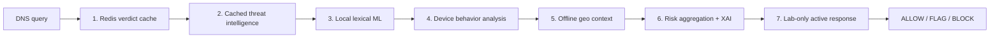
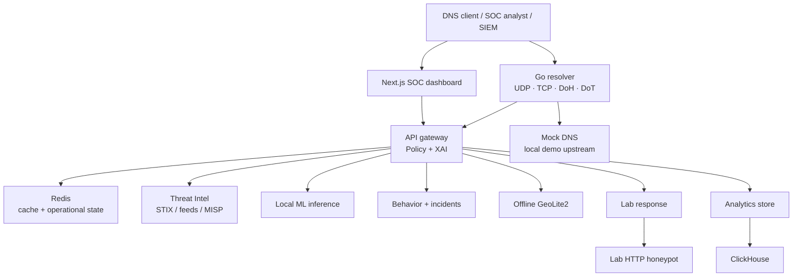

# DNS Shield — AI-Powered Secure DNS Filtering & Threat Intelligence Platform

**SIH260003 · ISRO · Software / Space Technology**

DNS Shield is a hackathon-focused, microservice-based DNS-security platform. It evaluates DNS requests before resolution, combines cached intelligence, local lexical analysis, device behavior, and optional offline geo context, then returns an explainable `ALLOW`, `FLAG`, or `BLOCK` decision. It supports both live DNS filtering and passive forensic replay of PCAP/PCAPNG/Zeek DNS data.

> Current state: the detailed code and local demo infrastructure are written, but the stack has **not been started or tested yet**. Do not claim performance, model quality, public hosting, or verified protocol support until `TEST_PLAN.md` has actual evidence.

## Why DNS Shield

DNS resolution is typically the first network action before a device contacts an internet service. Filtering there helps stop known malicious domains and detect suspicious new names before an application reaches them.

DNS Shield is designed to demonstrate:

- known-bad domain blocking from cached threat intelligence;
- zero-day-style lexical detection for DGAs and typosquatting;
- device-level behavior and DNS-tunnelling signals;
- explainable decisions instead of a black-box block screen;
- virtual-lab sinkholing and quarantine workflow;
- SOC dashboard, API, notebook visualizations, and passive forensic analysis.

## Core capabilities

| Capability | Implementation status |
|---|---|
| Active DNS filtering | Go resolver code for UDP/TCP DNS, DoH, DoT; pending runtime verification |
| Passive analysis | PCAP, PCAPNG, and Zeek DNS extraction + shared pipeline replay |
| Threat intelligence | Redis indicator cache, STIX 2.1 export, URLhaus/OTX/CERT-In/MISP integration paths |
| Local ML | Deterministic lexical baseline + optional local Scikit-learn artifacts |
| Behavior/incident engine | Device risk, tunnelling/fan-out signals, domain/device reputation, correlated incidents |
| Geo context | Offline GeoLite2 City/ASN enrichment, never blocks alone |
| Active response | Lab-only virtual sinkhole/quarantine, audit log, HTTP honeypot telemetry |
| Analytics | ClickHouse events, feedback, trends, PCAP/Zeek forensic extraction |
| SOC UI | Dashboard, XAI pipeline view, trends, incidents, 3D threat globe, quarantine controls |
| Visual analysis | Jupyter notebook that charts real gateway results after test execution |

## Seven-stage filtering pipeline



The order is deliberate: fast/high-confidence checks run before more contextual work. A known intelligence hit blocks immediately; uncertain ML alone becomes `FLAG`, not `BLOCK`; geo adds context only. Every stage emits reasons and score contribution for the dashboard/API.

Read [Component and Design Guide](docs/COMPONENT_AND_DESIGN_GUIDE.md) for the detailed reasoning behind each layer and technology choice.

## Architecture



For the full runtime topology, active/passive sequence diagrams, degradation behavior, and local operating boundaries, see [System Flow and Operations Guide](docs/SYSTEM_FLOW_AND_OPERATIONS_GUIDE.md).

## Repository layout

```text
SIH-DNS-wala-project/
├── services/
│   ├── resolver-core/       Go DNS / DoH / DoT enforcement point
│   ├── api-gateway/         seven-stage policy and SIEM REST API
│   ├── threat-intel/        feed, STIX, MISP and Redis indicator handling
│   ├── ml-inference/        local lexical analysis and model artifacts
│   ├── behavioral-engine/   device risk, reputation and incidents
│   ├── geo-intel/           offline GeoLite2 enrichment
│   ├── active-response/     virtual-lab sinkhole/quarantine/audit
│   ├── lab-honeypot/        safe decoy HTTP listener
│   └── analytics-store/     ClickHouse events and passive parsing
├── dashboard/               Next.js SOC interface
├── infra/                   Compose, mock DNS, TLS, simulations, security docs
├── ml-training/             reproducible local training/export script
├── notebooks/               Jupyter SOC analysis and visual evidence
├── docs/                    architecture, API, design and system-flow guides
├── TEST_PLAN.md             authoritative pass/fail checklist
├── PRE_TEST_READINESS.md    what remains before test execution
├── RUN_AND_TEST.md          local setup and test commands
├── HANDOFF.md               implementation inventory and remaining backlog
└── PROGRESS.md              chronological implementation status
```

## Local demo topology

The initial demo runs on one machine using Docker Compose. The resolver receives requests on host ports `5353` (UDP/TCP), `8443` (DoH), and `8853` (DoT after TLS setup). Dashboard is at `http://localhost:3000`; API documentation is at `http://localhost:8080/docs`.

The default resolver upstream is an internal `mock-dns` service, not public DNS. This makes benign lookups and gateway-fallback tests reproducible. The lab honeypot is internal-only at `172.28.0.250`; it never changes host firewall settings or interacts with external targets.

## Start only when execution is authorized

The current build process intentionally deferred all execution. Before starting containers, read [Pre-Test Readiness](PRE_TEST_READINESS.md), then follow [Run and Test Guide](RUN_AND_TEST.md) and the ordered [Test Plan](TEST_PLAN.md).

```powershell
Copy-Item .env.example .env
# Optional for DoH/DoT: follow infra/certs/README.md to create local-only TLS files
docker compose -f infra/docker-compose.yml up --build
```

Do not expose the resolver publicly, use paid cloud resources, publish to MISP, or configure external feeds without explicit approval.

## Safe demo scenarios

After the stack is healthy and testing is approved, run the named local scenarios:

```powershell
docker compose -f infra/docker-compose.yml --profile simulation run --rm simulation-benign
docker compose -f infra/docker-compose.yml --profile simulation run --rm simulation-dga
docker compose -f infra/docker-compose.yml --profile simulation run --rm simulation-tunnelling
docker compose -f infra/docker-compose.yml --profile simulation run --rm simulation-c2
docker compose -f infra/docker-compose.yml --profile simulation run --rm simulation-typosquat
```

They only call the internal gateway and are not external attack tools.

## Jupyter visualization companion

After real events exist, open [notebooks/01_soc_demo_analysis.ipynb](notebooks/01_soc_demo_analysis.ipynb). It produces charts based on real gateway responses: XAI pipeline contributions, verdicts, risk trends, incidents, reputation, feed health, and model state.

See [notebooks/README.md](notebooks/README.md) for setup. Never store API keys in notebook cells.

## Documentation map

| Document | Use it for |
|---|---|
| [COMPONENT_AND_DESIGN_GUIDE.md](docs/COMPONENT_AND_DESIGN_GUIDE.md) | What each service/file group does and why it was chosen |
| [SYSTEM_FLOW_AND_OPERATIONS_GUIDE.md](docs/SYSTEM_FLOW_AND_OPERATIONS_GUIDE.md) | Runtime topology, request flows, operating model, degradation behavior |
| [TEST_PLAN.md](TEST_PLAN.md) | Exact pass/fail test path and evidence requirements |
| [PRE_TEST_READINESS.md](PRE_TEST_READINESS.md) | Remaining work and test-transition decision |
| [RUN_AND_TEST.md](RUN_AND_TEST.md) | Copy-paste local setup/test commands |
| [HANDOFF.md](HANDOFF.md) | Work inventory, priorities, and next-agent instructions |
| [infra/SECURITY_CHECKLIST.md](infra/SECURITY_CHECKLIST.md) | Hosted-demo security review |
| [infra/ACCESS_CONTROL.md](infra/ACCESS_CONTROL.md) | Gateway API key/rate-limit behavior |
| [infra/OBSERVABILITY.md](infra/OBSERVABILITY.md) | Metrics, correlation IDs, evidence collection |

## Current scope and honest limitations

The hackathon core is code-complete enough for a first local testing cycle, but none of the following have been verified yet:

- p50/p95/p99 latency or `<100ms` target;
- sustained QPS/concurrency;
- model precision/recall/F1 or false-positive rate;
- actual OTX/CERT-In/MISP ingestion;
- DoH/DoT runtime behavior;
- full browser interaction and Compose startup;
- hosted URL, QR code, or demo recording.

See [PRE_TEST_READINESS.md](PRE_TEST_READINESS.md) for the precise remaining work and testing transition.

