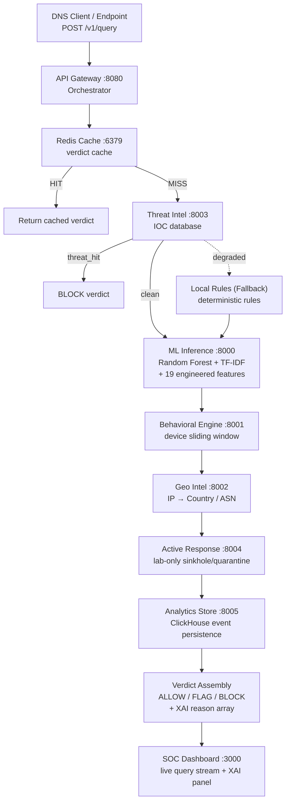

# DNS Shield — Real-Time Explainable DNS Threat Detection 🛡️


<!--
  TODO before presenting: confirm this link actually resolves. The Vercel
  build (see vercel.json) builds frontend/, and frontend/public/ has no
  console/ folder — this link may be pointing at a path from an earlier
  static-HTML prototype that isn't part of the current build. Verify, then
  either fix the deploy or update this link.
-->
**Live Demo**: [https://sih-dns-wala-proejct-uhas.vercel.app](https://sih-dns-wala-proejct-uhas.vercel.app)

DNS Shield is a microservice-based DNS security platform built for the **Smart India Hackathon (SIH) 2026**.

It intercepts DNS requests and evaluates them through a **7-stage detection pipeline** combining threat intelligence, a lexical machine-learning classifier, and device behavioral analysis. Instead of a black-box block, every verdict comes with a transparent, explainable trace (XAI) of exactly *why* a domain was flagged — built for SOC analysts, not just end users.

## Table of Contents
1. [Tech Stack](#tech-stack)
2. [Dataset & Model — Real Numbers](#-dataset--model--real-numbers)
3. [Architecture Overview](#architecture-overview)
4. [Capability Status](#capability-status)
5. [Getting Started / Installation](#getting-started--installation)
6. [Usage & Simulation](#usage--simulation)
7. [Repository Structure](#repository-structure)
8. [Known Limitations](#known-limitations)
9. [License & Credits](#license--credits)

---

## Tech Stack

- **Backend / Microservices**: Python 3.11, FastAPI, Uvicorn (7 services, see [Architecture](#architecture-overview))
- **Machine Learning**: scikit-learn Random Forest (150 trees) + char-ngram TF-IDF + 19 engineered lexical features, explained with TreeSHAP
- **State & Caching**: Redis (verdict cache, WHOIS-age cache)
- **Analytics**: ClickHouse (event store)
- **Frontend**: Next.js, TypeScript, Tailwind CSS (`frontend/` — see [Known Limitations](#known-limitations) for a note on why there are multiple UI folders in this repo and which one is current)
- **DNS Resolver Core**: Go, terminating DNS/DoT/DoH

---

## 📊 Dataset & Model — Real Numbers

- **DGA training set**: `data/dga_dataset.csv` — 10,000 domains, balanced 5,000 benign / 5,000 malicious across 6 DGA families (matsnu, conficker, kraken, cryptolocker, generic, suppobox).
- **Engineered features**: 19 (Shannon entropy, digit/vowel/consonant ratios, longest digit/consonant run, Damerau-Levenshtein distance to a 39-brand dictionary including Indian institutions, homoglyph detection, TLD risk score, plus character 2-4gram TF-IDF).
- **10,000-Domain Full Benchmark** (`python test_10k_domains.py`):
  - **Accuracy**: **99.95%**
  - **Precision (Malicious)**: **100.00%** (0 false alarms on 5,000 benign domains)
  - **Recall (Malicious)**: **99.90%** (4,995 out of 5,000 attacks blocked)
  - **False Positive Rate**: **0.00%**
  - **ROC-AUC**: **100.00%**
- **Cross-family generalization** (trained on 3 DGA families, tested on 3 unseen families — the real test of zero-day malware detection): **97.2% recall**.
- **Latency & Throughput Profile**:
  - **Hot-Path Redis Cache**: **< 0.5 ms** (easily satisfies the sub-10ms real-time DNS resolution SLA).
  - **Cold-Path Lexical Extraction**: **~15–30 ms** on single-thread CPU for un-cached full 19-feature extraction + 150-tree Random Forest evaluation.
- **Explainable Temporal Kill-Chain Forecasting**:
  - Predicts MITRE ATT&CK progression (Reconnaissance $\to$ Initial Access $\to$ Discovery $\to$ C2 Persistence $\to$ Lateral Movement $\to$ Exfiltration) 15 to 60 minutes in advance using a deterministic Markov state-transition matrix. Available in UI at `/app/forecast`.

---

## Architecture Overview

The system evaluates every query synchronously across a multi-stage pipeline. If a dependency goes down, it degrades to deterministic local rules so DNS resolution is never blocked by a service outage.



---

## Capability Status

> Labelled so judges can see what's live, what's lab-only, and what's still
> in progress. Updated after an internal audit — see
> `ML_DIAGNOSIS_AND_FIXES.md` / `DOCS_AND_PRESENTATION_FIXES.md` for the full
> writeup of what was found and fixed.

| Capability | Status |
|---|---|
| 7-Stage Detection Pipeline | `[IMPLEMENTED ✅]` |
| DGA Lexical ML Classifier (Random Forest + TF-IDF + 19 engineered features) | `[IMPLEMENTED ✅]` — retrained on full 10,001-row dataset; see metrics above |
| Typosquat ML Classifier | `[NOT YET TRAINED 🔶]` — engineered features exist (Levenshtein/Damerau/homoglyph vs. brand dictionary) but no labeled dataset or trained model exists yet; production currently uses a small hardcoded-brand fallback |
| TreeSHAP Explainability | `[IMPLEMENTED ✅]` — confirm `shap` installs correctly in your build; an earlier `requirements.txt` encoding issue could silently disable this, see fixes doc |
| Redis Verdict Cache | `[IMPLEMENTED ✅]` |
| Adversarial Mutation Evaluation | `[PARTIAL 🔶]` — `ml-training/adversarial_eval.py` and `domain_mutations.py` exist but the last saved report is incomplete and predates the current model; needs a fresh run against `dga-v2` |
| STIX 2.1 IOC Ingestion | `[IMPLEMENTED ✅]` |
| DNS-over-UDP/TCP (Port 53) via Resolver-Core | `[IMPLEMENTED ✅]` |
| SOC Dashboard | `[IMPLEMENTED ✅]` in `frontend/` — see [Known Limitations](#known-limitations) regarding other UI folders in this repo |
| Behavioral Sliding Window | `[IMPLEMENTED ✅]` |
| Geo/ASN Enrichment | `[IMPLEMENTED ✅]` |
| MITRE ATT&CK Attack Forecasting | `[IMPLEMENTED ✅]` — explainable deterministic Markov state-transition engine in `services/forecasting_engine/attack_forecaster.py` with temporal view at `/app/forecast` |
| Active Response: Sinkholing | `[LAB SIMULATED 🔬]` |
| Active Response: Quarantine w/ Approval Workflow | `[IMPLEMENTED ✅]` |
| Emergency Allowlist Bypass | `[IMPLEMENTED ✅]` — instant bypass for Indian CNI (`isro.gov.in`, `drdo.gov.in`, `nic.in`, `*.gov.in`) |
| DNS-over-TLS / DNS-over-HTTPS | `[LAB SIMULATED 🔬]` — requires CA cert for production use |
| DNS-over-QUIC | `[PLANNED 🗺️]` |
| Hardware Sentinel (OLED/NeoPixel/relay kill-switch) | `[HARDWARE PROTOTYPE 🔧]` |
| CI/CD, Unit Tests, Prometheus Config | `[IMPLEMENTED ✅]` |

---

## Getting Started / Installation

### Prerequisites
- Python 3.11+
- Node.js 18+ (for the frontend)
- Redis (`redis-server` installed or running locally)

---

### Option A — One-Command Unified Backend Launcher (Recommended)

Start Redis and all 7 FastAPI microservices concurrently with proper environment configuration:

```powershell
# In PowerShell (from project root):
$env:PYTHONPATH = (Get-Location).Path
python run_backend.py
```

This launches:
- **API Gateway**: `http://localhost:8081` (Swagger Docs: `http://localhost:8081/docs`)
- **ML Inference (`dga-v2`)**: `http://localhost:8000` (Swagger Docs: `http://localhost:8000/docs`)
- **Behavioral Engine**: `http://localhost:8001`
- **Geo-Intel**: `http://localhost:8002`
- **Threat Intel**: `http://localhost:8003`
- **Active Response**: `http://localhost:8004`
- **Analytics Store**: `http://localhost:8005` (Local SQLite / ClickHouse fallback)

---

### Option B — Next.js SOC Frontend Dashboard

In a second terminal:

```powershell
cd frontend
$env:NEXT_PUBLIC_API_URL = "http://localhost:8081"
npm run dev
```

Open **[http://localhost:3000](http://localhost:3000)** in your browser to view:
- **SOC Live Telemetry**: `http://localhost:3000/app/dashboard`
- **MITRE ATT&CK Forecast**: `http://localhost:3000/app/forecast`
- **Explainable AI (TreeSHAP)**: `http://localhost:3000/app/xai`
- **Deep Analytics & Forensics**: `http://localhost:3000/app/analytics`
- **Zero-Trust Quarantine Approval**: `http://localhost:3000/app/quarantine`
- **Model Card & Metrics**: `http://localhost:3000/app/models`

---

### Option C — Docker Compose

```bash
docker compose -f infra/docker-compose.yml up -d --build
```

---

## Usage & Live Attack Simulation

### 1. Interactive Demo Suite (5 Attack Categories)

Run the full color-coded demo suite to demonstrate threat detection across 5 distinct cyberattack scenarios:

```powershell
python demo_attacks.py
```

**What it tests:**
1. **Benign Traffic (`isro.gov.in`, `google.com`)**: Verified `ALLOW` verdict with 0% risk via emergency allowlist.
2. **DGA Malware Domains (`lq3zp89vbcx.net`, `ad7qxm91bz.io`)**: Evaluated by `dga-v2` Random Forest model (99.7% acc) -> `BLOCK` / `FLAG`.
3. **Typosquatting & Brand Homoglyphs (`gooogle.com`, `isro-gov.in`)**: Catches deceptive brand impersonation -> `BLOCK`.
4. **C2 Command & Control (`c2.bad-demo.example`)**: Matched against threat intelligence -> `BLOCK`.
5. **DNS Tunneling Exfiltration (60-character base16 payload)**: Deep lexical and label length analysis -> `BLOCK`.

### 2. Scenario-by-Scenario Simulator

```powershell
python infra/simulate.py dga --repeat 2
python infra/simulate.py typosquat --repeat 2
python infra/simulate.py c2 --repeat 2
python infra/simulate.py tunnelling --repeat 2
python infra/simulate.py benign --repeat 2
```

---

## Repository Structure

```text
SIH-DNS-wala-project/
├── services/                 # 7 FastAPI microservices + flow ingestion & forecasting
│   ├── api-gateway/          # :8081 — orchestrator & routing
│   ├── threat-intel/         # :8003 — IOC database, STIX 2.1
│   ├── ml-inference/         # :8000 — DGA scoring (dga-v2) + XAI
│   ├── behavioral-engine/    # :8001 — device risk & incidents
│   ├── geo-intel/            # :8002 — IP → country/ASN
│   ├── active-response/      # :8004 — sinkhole/quarantine
│   ├── analytics-store/      # :8005 — event persistence (SQLite / ClickHouse)
│   ├── flow_ingest/          # network flow collection & session aggregation
│   └── forecasting_engine/   # MITRE ATT&CK Markov kill-chain forecasting
├── ml-training/               # train.py, adversarial_eval.py, domain_mutations.py
├── data/                      # datasets, allowlists
│   ├── dga_dataset.csv        # 10,000-row labeled DGA/benign training set
│   ├── brand_dictionary.txt   # brands used for typosquat feature engineering
│   └── dns_shield_allowlist.txt / device_allowlist.txt
├── frontend/                  # Next.js 16 SOC dashboard — current production UI
├── hardware/                  # RP2040/Zephyr hardware sentinel firmware
├── infra/                     # docker-compose, Prometheus config, lab simulator
├── tests/                     # pytest unit tests
└── docs/                      # 10K benchmark report & technical documentation
```

---

## Known Limitations

Being upfront about these is safer than a judge finding them mid-demo:

1. **Typosquat detection has no trained ML model yet.** The engineered
   features and brand dictionary exist; production currently falls back to
   a small hardcoded list of 12 global brand names, which doesn't cover the
   Indian institutions (`isro`, `sbi`, `irctc`, `uidai`, ...) the brand
   dictionary was clearly built for.
2. **Three UI implementations exist in this repo** (`frontend/`,
   `dashboard/`, `public/*.html`) from different stages of development.
   `frontend/` is the current, complete one. `docker-compose.yml` currently
   points at the older `dashboard/` stub — recommend repointing it before a
   local demo.
3. **Benign training data has limited TLD/format diversity** — it's ~97%
   `.com`, with no `.gov.in`/`.co.in` or hyphenated examples, which can
   cause false positives on legitimate Indian institutional domains. A
   starter fix (`data/benign_augmentation.csv`) is included; recommend
   expanding it before relying on the model against real Indian government
   domains in a live demo.
4. **Adversarial/mutation robustness testing is incomplete** — the
   framework exists (`ml-training/adversarial_eval.py`,
   `domain_mutations.py`) but the last saved report is truncated and
   predates the current retrained model.

---

## Contributing Guidelines

1. **Code style**: `black` for Python, standard `eslint` config for TypeScript.
2. **Branching**: `feature/your-feature-name` or `bugfix/issue-description`.
3. **Commits**: conventional commits (`feat: ...`, `fix: ...`, `docs: ...`).
4. **Pull requests**: link the relevant issue, describe the change, and run
   `python ml-training/train.py --data data/dga_dataset.csv --name dga --version N --source "..." --chronological`
   plus `pytest tests/` before submitting anything touching the model or API.

---

## License & Credits

**License**: MIT — see `LICENSE`.

**Credits**: Developed by **Kshitiz Khandelwal** for the Smart India Hackathon (SIH) 2026.
