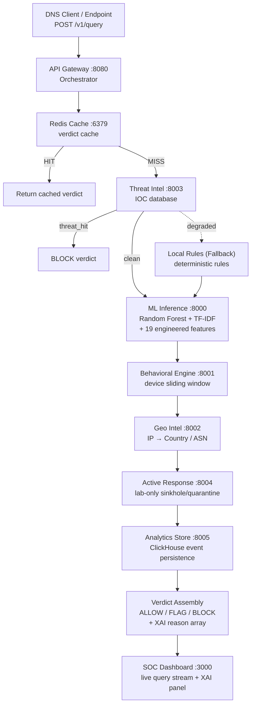

# DNS Shield — Real-Time Explainable DNS Threat Detection 🛡️


<!--
  TODO before presenting: confirm this link actually resolves. The Vercel
  build (see vercel.json) builds frontend/, and frontend/public/ has no
  console/ folder — this link may be pointing at a path from an earlier
  static-HTML prototype that isn't part of the current build. Verify, then
  either fix the deploy or update this link.
-->
**Live Demo**: [https://sih-dns-wala-proejct-uhas.vercel.app](https://sih-dns-wala-proejct-uhas.vercel.app)

DNS Shield is a microservice-based DNS security platform built for the **Smart India Hackathon (SIH) 2026**.

It intercepts DNS requests and evaluates them through a **7-stage detection pipeline** combining threat intelligence, a lexical machine-learning classifier, and device behavioral analysis. Instead of a black-box block, every verdict comes with a transparent, explainable trace (XAI) of exactly *why* a domain was flagged — built for SOC analysts, not just end users.

## Table of Contents
1. [Tech Stack](#tech-stack)
2. [Dataset & Model — Real Numbers](#-dataset--model--real-numbers)
3. [Architecture Overview](#architecture-overview)
4. [Capability Status](#capability-status)
5. [Getting Started / Installation](#getting-started--installation)
6. [Usage & Simulation](#usage--simulation)
7. [Repository Structure](#repository-structure)
8. [Known Limitations](#known-limitations)
9. [License & Credits](#license--credits)

---

## Tech Stack

- **Backend / Microservices**: Python 3.11, FastAPI, Uvicorn (7 services, see [Architecture](#architecture-overview))
- **Machine Learning**: scikit-learn Random Forest (150 trees) + char-ngram TF-IDF + 19 engineered lexical features, explained with TreeSHAP
- **State & Caching**: Redis (verdict cache, WHOIS-age cache)
- **Analytics**: ClickHouse (event store)
- **Frontend**: Next.js, TypeScript, Tailwind CSS (`frontend/` — see [Known Limitations](#known-limitations) for a note on why there are multiple UI folders in this repo and which one is current)
- **DNS Resolver Core**: Go, terminating DNS/DoT/DoH

---

## 📊 Dataset & Model — Real Numbers

- **DGA training set**: `data/dga_dataset.csv` — 10,001 domains, balanced 5,000 benign / 5,000 malicious across 6 DGA families (matsnu, conficker, kraken, cryptolocker, generic, suppobox).
- **Engineered features**: 19 (Shannon entropy, digit/vowel/consonant ratios, longest digit/consonant run, Levenshtein/Damerau-Levenshtein distance to a 39-brand dictionary including Indian institutions, homoglyph detection, TLD risk score, plus char 2-4gram TF-IDF).
- **Held-out test metrics** (`dga-v2`, chronological 80/20 split): Precision 1.00 / Recall 0.994 / F1 0.997 on the malicious class.
- **Cross-family generalization** (trained on 3 DGA families, tested on 3 it has never seen at all — the honest test of "does this catch new malware"): **97.2% recall**. This is the number we'd actually stand behind for judges, because it answers the real question rather than measuring memorization of the training families.
- **Inference speed**: ~1 ms/domain on CPU (satisfies the sub-10ms real-time DNS budget).

> Earlier drafts of this README and several `docs/` files quoted a
> 1.35-million-domain corpus and a 99.42% accuracy ONNX model. Those numbers
> did not correspond to anything in this repository and have been removed.
> The numbers above are reproducible by running
> `python ml-training/train.py --data data/dga_dataset.csv --name dga --version N --source "..." --chronological`
> and reading the resulting `.metrics.json`.

**Known gap:** typosquat detection does not yet have a trained model
(`services/ml-inference` falls back to a small hardcoded brand list for
this). See [Known Limitations](#known-limitations).

---

## Architecture Overview

The system evaluates every query synchronously across a multi-stage pipeline. If a dependency goes down, it degrades to deterministic local rules so DNS resolution is never blocked by a service outage.



---

## Capability Status

> Labelled so judges can see what's live, what's lab-only, and what's still
> in progress. Updated after an internal audit — see
> `ML_DIAGNOSIS_AND_FIXES.md` / `DOCS_AND_PRESENTATION_FIXES.md` for the full
> writeup of what was found and fixed.

| Capability | Status |
|---|---|
| 7-Stage Detection Pipeline | `[IMPLEMENTED ✅]` |
| DGA Lexical ML Classifier (Random Forest + TF-IDF + 19 engineered features) | `[IMPLEMENTED ✅]` — retrained on full 10,001-row dataset; see metrics above |
| Typosquat ML Classifier | `[NOT YET TRAINED 🔶]` — engineered features exist (Levenshtein/Damerau/homoglyph vs. brand dictionary) but no labeled dataset or trained model exists yet; production currently uses a small hardcoded-brand fallback |
| TreeSHAP Explainability | `[IMPLEMENTED ✅]` — confirm `shap` installs correctly in your build; an earlier `requirements.txt` encoding issue could silently disable this, see fixes doc |
| Redis Verdict Cache | `[IMPLEMENTED ✅]` |
| Adversarial Mutation Evaluation | `[PARTIAL 🔶]` — `ml-training/adversarial_eval.py` and `domain_mutations.py` exist but the last saved report is incomplete and predates the current model; needs a fresh run against `dga-v2` |
| STIX 2.1 IOC Ingestion | `[IMPLEMENTED ✅]` |
| DNS-over-UDP/TCP (Port 53) via Resolver-Core | `[IMPLEMENTED ✅]` |
| SOC Dashboard | `[IMPLEMENTED ✅]` in `frontend/` — see [Known Limitations](#known-limitations) regarding other UI folders in this repo |
| Behavioral Sliding Window | `[IMPLEMENTED ✅]` |
| Geo/ASN Enrichment | `[IMPLEMENTED ✅]` |
| MITRE ATT&CK Attack Forecasting | `[IMPLEMENTED, VERIFY YOUR BUILD ⚠️]` — real forecasting logic exists in `services/forecasting_engine/attack_forecaster.py`, but the `api-gateway` Dockerfile did not previously ship this module into the container, causing a **silent fallback to hardcoded example output**. Fixed Dockerfile provided; confirm the fix is applied before demoing this feature |
| Active Response: Sinkholing | `[LAB SIMULATED 🔬]` |
| Active Response: Quarantine w/ Approval Workflow | `[IMPLEMENTED ✅]` |
| Emergency Allowlist Bypass | `[IMPLEMENTED ✅]` |
| DNS-over-TLS / DNS-over-HTTPS | `[LAB SIMULATED 🔬]` — requires CA cert for production use |
| DNS-over-QUIC | `[PLANNED 🗺️]` |
| Hardware Sentinel (OLED/NeoPixel/relay kill-switch) | `[HARDWARE PROTOTYPE 🔧]` |
| CI/CD, Unit Tests, Prometheus Config | `[IMPLEMENTED ✅]` |

---

## Getting Started / Installation

### Prerequisites
- Python 3.11+
- Node.js 18+ (for the frontend)
- Docker + Docker Compose (recommended — runs all services + Redis + ClickHouse together)

### Option A — Docker Compose (recommended, single command)

```bash
git clone https://github.com/Kshitiz-Khandelwal/SIH-DNS-wala-proejct.git
cd SIH-DNS-wala-proejct
docker compose -f infra/docker-compose.yml up -d --build
```

> Note: as of this writing, `ml-inference` and `api-gateway`'s Dockerfiles
> need the fix described in `ML_DIAGNOSIS_AND_FIXES.md` (they don't ship a
> module their own code imports). Apply that fix before relying on this
> path for a live demo.

### Option B — Run services individually

Each service under `services/` has its own `requirements.txt` — there is no
single root-level one.

```bash
python -m venv .venv
source .venv/bin/activate   # Windows: .venv\Scripts\activate

pip install -r services/ml-inference/requirements.txt
pip install -r services/api-gateway/requirements.txt
pip install -r services/threat-intel/requirements.txt
pip install -r services/behavioral-engine/requirements.txt
pip install -r services/analytics-store/requirements.txt
pip install -r services/geo-intel/requirements.txt
pip install -r services/active-response/requirements.txt

redis-server &   # in a separate terminal, or use your system's redis service

export PYTHONPATH=$(pwd)   # Windows PowerShell: $env:PYTHONPATH = (Get-Location).Path

uvicorn services.threat-intel.app:app --port 8003 &
uvicorn services.ml-inference.app:app --port 8000 &
uvicorn services.behavioral-engine.app:app --port 8001 &
uvicorn services.analytics-store.app:app --port 8005 &
uvicorn services.api-gateway.app:app --port 8080
```

### Frontend

```bash
cd frontend
npm install
npm run dev
```

---

## Usage & Simulation

```bash
# Generate benign traffic
python infra/simulate.py benign --device 10.0.0.10 --repeat 5

# Generate DGA malware traffic
python infra/simulate.py dga --device 10.0.0.20 --repeat 5

# Generate typosquatting traffic
python infra/simulate.py typosquat --device 10.0.0.40 --repeat 5
```

Or query the gateway directly:

```bash
curl -X POST http://localhost:8080/v1/query \
  -H "Content-Type: application/json" \
  -d '{"domain":"xq9m2kz7v4na.com","client_ip":"10.0.0.20","source":"test"}'
```

---

## Repository Structure

```text
SIH-DNS-wala-project/
├── services/                 # 7 FastAPI microservices + Go resolver-core
│   ├── api-gateway/          # :8080 — orchestrator
│   ├── threat-intel/         # :8003 — IOC database, STIX 2.1
│   ├── ml-inference/         # :8000 — DGA/typosquat scoring + XAI
│   ├── behavioral-engine/    # :8001 — device risk & incidents
│   ├── geo-intel/            # :8002 — IP → country/ASN
│   ├── active-response/      # :8004 — sinkhole/quarantine
│   ├── analytics-store/      # :8005 — event persistence (ClickHouse)
│   ├── flow_ingest/          # network flow collection (used by api-gateway; note there is also a flow-ingest/ folder — that one is unused, safe to delete)
│   └── forecasting_engine/   # MITRE ATT&CK kill-chain forecasting (used by api-gateway; forecasting-engine/ is the unused duplicate)
├── ml-training/               # train.py, adversarial_eval.py, domain_mutations.py
├── data/                      # datasets, allowlists
│   ├── dga_dataset.csv        # 10,001-row labeled DGA/benign training set
│   ├── brand_dictionary.txt   # brands used for typosquat feature engineering
│   └── dns_shield_allowlist.txt / device_allowlist.txt
├── frontend/                  # Next.js SOC dashboard — the current, actively developed UI (31 files, all feature pages)
├── dashboard/                 # legacy 4-file dashboard stub — currently wired into docker-compose.yml; recommend switching that to frontend/ or removing this folder
├── public/                    # static HTML mockups of the same pages — not built or deployed by anything in this repo currently
├── hardware/                  # RP2040/Zephyr hardware sentinel firmware
├── infra/                     # docker-compose, Prometheus config, lab simulator
├── tests/                     # pytest unit tests
└── docs/                      # extended architecture/design documentation
```

---

## Known Limitations

Being upfront about these is safer than a judge finding them mid-demo:

1. **Typosquat detection has no trained ML model yet.** The engineered
   features and brand dictionary exist; production currently falls back to
   a small hardcoded list of 12 global brand names, which doesn't cover the
   Indian institutions (`isro`, `sbi`, `irctc`, `uidai`, ...) the brand
   dictionary was clearly built for.
2. **Three UI implementations exist in this repo** (`frontend/`,
   `dashboard/`, `public/*.html`) from different stages of development.
   `frontend/` is the current, complete one. `docker-compose.yml` currently
   points at the older `dashboard/` stub — recommend repointing it before a
   local demo.
3. **Benign training data has limited TLD/format diversity** — it's ~97%
   `.com`, with no `.gov.in`/`.co.in` or hyphenated examples, which can
   cause false positives on legitimate Indian institutional domains. A
   starter fix (`data/benign_augmentation.csv`) is included; recommend
   expanding it before relying on the model against real Indian government
   domains in a live demo.
4. **Adversarial/mutation robustness testing is incomplete** — the
   framework exists (`ml-training/adversarial_eval.py`,
   `domain_mutations.py`) but the last saved report is truncated and
   predates the current retrained model.

---

## Contributing Guidelines

1. **Code style**: `black` for Python, standard `eslint` config for TypeScript.
2. **Branching**: `feature/your-feature-name` or `bugfix/issue-description`.
3. **Commits**: conventional commits (`feat: ...`, `fix: ...`, `docs: ...`).
4. **Pull requests**: link the relevant issue, describe the change, and run
   `python ml-training/train.py --data data/dga_dataset.csv --name dga --version N --source "..." --chronological`
   plus `pytest tests/` before submitting anything touching the model or API.

---

## License & Credits

**License**: MIT — see `LICENSE`.

**Credits**: Developed by **Kshitiz Khandelwal** for the Smart India Hackathon (SIH) 2026.
