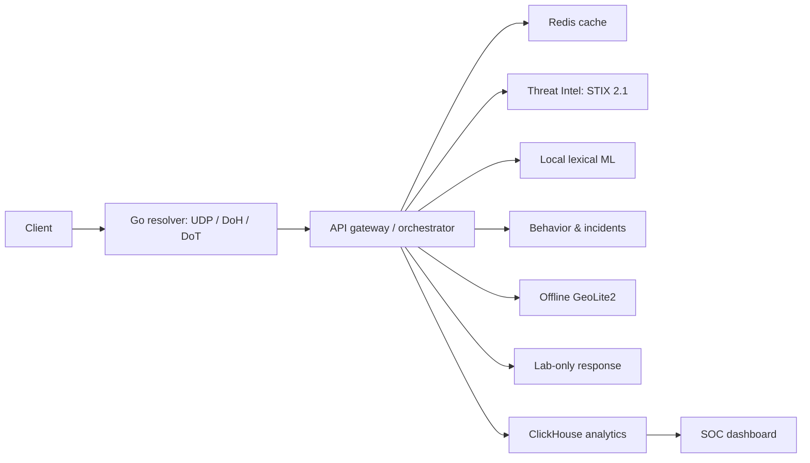

# Architecture

The resolver fails open to its configured upstream only if the gateway is unavailable. Within the gateway, dependency failures appear in `degraded_dependencies`: cached threat intelligence remains usable, unavailable ML cannot independently block, and unavailable Geo intelligence contributes zero risk. Active response records lab-network quarantine state only; it never calls host firewall tooling.

Parent-domain analysis is emitted by the behavioral engine alongside every observation. Redis holds current domain/device operational state; ClickHouse retains forensic event history.

The dashboard’s Three.js globe takes blocked events from the analytics API and draws arcs from the lab origin to the target coordinates returned by the offline GeoLite2 service. When the optional database is unavailable, the UI makes no geo-security claim and uses deterministic display-only positions for the demo.
