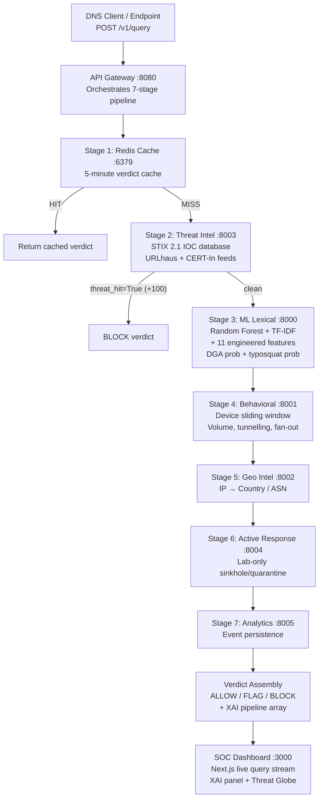
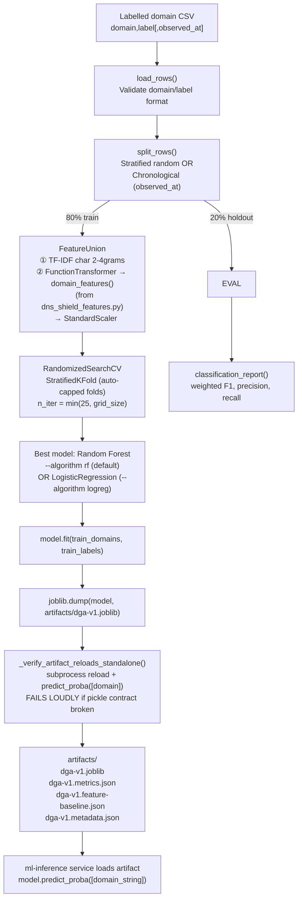

# DNS Shield — Flow Diagrams

> **Project**: DNS Shield — Real-Time Explainable DNS Threat Detection  
> **Author**: Kshitiz Khandelwal  
> **Event**: Smart India Hackathon (SIH) 2026

---

## 1. End-to-End System Flow (ASCII)

```
DNS Client / Endpoint Device
(e.g., LAPTOP-01, 10.0.0.10)
          |
          | POST /v1/query {"domain": "...", "client_ip": "..."}
          v
┌──────────────────────────────────────────────────────────┐
│                    API GATEWAY :8080                      │
│         DNS Shield SIEM API  (FastAPI, Python)           │
│         Orchestrates all 7 stages synchronously          │
│         OpenAPI at /openapi.json, Prometheus at /metrics │
└────────────────────────┬─────────────────────────────────┘
                         |
          ┌──────────────▼──────────────┐
          │  STAGE 1 — REDIS CACHE      │
          │  Key: domain string         │
          │  TTL: 300 seconds (5 min)   │
          │  HIT → return cached verdict│
          │  MISS → continue pipeline   │
          └──────────────┬──────────────┘
                         | MISS
          ┌──────────────▼──────────────┐
          │  STAGE 2 — THREAT INTEL     │
          │  Service: threat-intel:8003 │
          │  GET /lookup/{domain}       │
          │  Match against STIX 2.1     │
          │  IOC database               │
          │  Sources: URLhaus, CERT-In  │
          │  HIT → domain_risk += 100   │
          │         → immediate BLOCK   │
          └──────────────┬──────────────┘
                         | (threat_hit flag set)
          ┌──────────────▼──────────────┐
          │  STAGE 3 — ML LEXICAL       │
          │  Service: ml-inference:8000 │
          │  POST /predict              │
          │  Input: domain string       │
          │  Features:                  │
          │  • char 2-4gram TF-IDF      │
          │  • 11 engineered features   │
          │    (entropy, digit_ratio,   │
          │     vowel_ratio, etc.)      │
          │  Models: Random Forest      │
          │  Outputs: dga_probability,  │
          │           typosquat_prob,   │
          │           contribution 0–70 │
          └──────────────┬──────────────┘
                         |
          ┌──────────────▼──────────────┐
          │  STAGE 4 — BEHAVIORAL       │
          │  Service: behavioral:8001   │
          │  POST /observe              │
          │  Tracks per-device 60s      │
          │  sliding window in Redis    │
          │  Detects:                   │
          │  • Volume spike (>50 qps)   │
          │  • DNS tunnelling (label    │
          │    length >45 chars)        │
          │  • TLD fan-out (>10 TLDs)   │
          │  • High entropy subdomain   │
          │  Contribution: 0–65         │
          └──────────────┬──────────────┘
                         |
          ┌──────────────▼──────────────┐
          │  STAGE 5 — GEO INTEL        │
          │  Service: geo-intel:8002    │
          │  Enriches resolved IP with  │
          │  country, ASN, coordinates  │
          │  Contribution: 0–20         │
          │  (high-risk regions)        │
          └──────────────┬──────────────┘
                         |
          ┌──────────────▼──────────────┐
          │  STAGE 6 — ACTIVE RESPONSE  │
          │  Service: active-res.:8004  │
          │  Lab-only: sinkhole / quar. │
          │  Validates client is in lab │
          │  subnet before acting       │
          └──────────────┬──────────────┘
                         |
          ┌──────────────▼──────────────┐
          │  STAGE 7 — ANALYTICS STORE  │
          │  Service: analytics:8005    │
          │  Persists full event:       │
          │  domain, verdict, pipeline, │
          │  timestamp, client_ip       │
          │  Feeds dashboard + feedback │
          └──────────────┬──────────────┘
                         |
          ┌──────────────▼──────────────┐
          │      VERDICT ASSEMBLY       │
          │  total_risk = sum of all    │
          │  stage contributions        │
          │                             │
          │  threat_hit = True → BLOCK  │
          │  risk >= 71    → BLOCK      │
          │  risk 41–70   → FLAG        │
          │  risk < 41    → ALLOW       │
          │                             │
          │  + confidence: LOW/MED/HIGH │
          │  + pipeline XAI array       │
          │  + degraded_dependencies[]  │
          └──────────────┬──────────────┘
                         |
          ┌──────────────▼──────────────┐
          │  Cache write (TTL 300s)      │
          │  → Return JSON response     │
          └─────────────────────────────┘
```

---

## 2. Mermaid Architecture Diagram



---

## 3. ML Training Pipeline Flow



---

## 4. Dashboard Data Flow

```
analytics-store:8005
        |
        | GET /events  (every 4s auto-refresh)
        | GET /stats   (24h ALLOW/FLAG/BLOCK counts)
        | GET /trends  (hourly risk time series)
        |
        v
SOC Dashboard :3000 (Next.js)
        |
        ├── Live Query Stream Table
        │       Row click → expand → 7-Stage Pipeline Cascade
        │                           (inline XAI breakdown)
        │
        ├── KPI Strip (Allowed / Flagged / Blocked / Open Incidents)
        │
        ├── Investigate Input
        │       → POST api-gateway:8080/v1/query
        │       → Shows real-time pipeline cascade + verdict
        │
        ├── 3D Threat Globe (Three.js)
        │       Red arcs = BLOCK events
        │       GeoLite2 coordinates (when geo-intel is online)
        │
        ├── Hourly Trend Chart
        │       Bar height = average domain risk
        │       Labels = blocked/flagged counts per hour
        │
        ├── Model Monitoring Panel
        │       Model version, metrics status, feature drift
        │
        └── Lab Response Controls
                Quarantine list from active-response:8004
                Release button (DELETE /v1/quarantine/{ip})
```

---

## 5. Graceful Degradation Flow

```
Service call fails or times out (>1.0s)
        |
        v
Gateway logs: degraded_dependencies = ["ml-lexical"]
        |
        ├── If threat-intel offline:
        │       Skip Stage 2, continue with ML only
        │       Downgrade: ML-only BLOCK → FLAG (safety net)
        │
        ├── If ml-inference offline:
        │       Skip Stage 3, contribution = 0
        │       Continue with threat-intel + behavioral only
        │
        ├── If behavioral offline:
        │       Skip Stage 4, continue with available stages
        │
        └── DNS resolution is NEVER blocked by service failure
                Response always includes degraded_dependencies[]
                so downstream systems know to treat verdict with lower confidence
```
