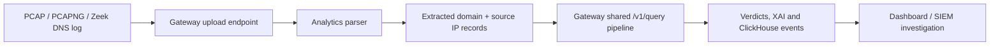

# DNS Shield System Flow and Operations Guide

This guide explains where DNS Shield runs, how a request moves through it, how the dashboard and passive mode use the same logic, and how to operate/test it safely.

## 1. Where the system runs

For development and the initial demo, the platform runs on one machine through Docker Compose:

```text
Your browser ── http://localhost:3000 ──> Dashboard container
                                      │
                                      └── http://localhost:8080 ──> API gateway container

DNS test client ── UDP/TCP 5353 ──> Go resolver container ──> API gateway
DNS test client ── HTTPS 8443 ────> Go resolver DoH handler ─> API gateway
DNS test client ── TLS 8853 ──────> Go resolver DoT handler ─> API gateway

API gateway ──> Redis / threat-intel / ML / behavior / geo / response / analytics
Resolver ────> mock-dns container (default local reproducible upstream)
Analytics ───> ClickHouse container
```

All containers are on the Docker network named `dns-shield-lab`. The only host-facing development ports are the ones listed in `infra/docker-compose.yml`. Internal backend services are exposed for local inspection during development; before hosting, reduce this exposure and place dashboard/API behind a reviewed HTTPS ingress.

## 2. Active DNS request flow

```mermaid
sequenceDiagram
    participant C as DNS client
    participant R as Go resolver
    participant G as API gateway
    participant X as Redis cache
    participant T as Threat Intel
    participant M as ML inference
    participant B as Behavioral engine
    participant Geo as Geo Intel
    participant A as Analytics/Response
    participant U as Mock or approved upstream DNS

    C->>R: DNS / DoH / DoT query for domain
    R->>G: POST /v1/query (domain, client IP)
    G->>X: Recent verdict lookup
    alt Cache hit
        X-->>G: Cached verdict
    else Cache miss
        G->>T: Indicator lookup
        alt Known malicious
            T-->>G: Hit and source attribution
        else Unknown name
            G->>M: Lexical probability/features
            G->>B: Device/window anomaly signals
            opt Resolved target IP supplied
                G->>Geo: Offline City/ASN enrichment
            end
        end
        G->>G: Aggregate risk and build XAI stages
        G->>A: Persist event; virtual response if threshold crossed
        G->>X: Cache verdict with TTL
    end
    G-->>R: ALLOW / FLAG / BLOCK plus optional sinkhole
    alt Allow or Flag
        R->>U: Resolve upstream DNS
        U-->>R: DNS response
        R-->>C: DNS answer
    else Block with sinkhole
        R-->>C: Lab sinkhole A record
    else Block without sinkhole
        R-->>C: NXDOMAIN
    end
```

### Step-by-step explanation

1. A client asks the resolver for a domain. The resolver supports normal DNS, DoH, and DoT so the same security policy is available across common DNS transports.
2. The resolver sends only the normalized domain and requester IP to the local gateway.
3. The gateway checks Redis for a recent verdict. This is the fast path.
4. On a miss, it checks cached threat indicators. A known bad match produces an immediate high-confidence block.
5. Unknown domains go through local lexical scoring and device behavior analysis. Geo lookup is optional and only happens when a target IP is supplied.
6. The gateway combines scores, applies uncertainty safeguards, and records every stage’s reason.
7. The decision event is persisted. A critical lab device can be put into virtual quarantine; blocked domains can activate virtual sinkholing.
8. The resolver enforces the final result. ALLOW and FLAG resolve upstream. BLOCK returns NXDOMAIN or the lab sinkhole address.

### Graceful-degradation behavior

| Dependency unavailable | What happens |
|---|---|
| Gateway unavailable | Resolver forwards to upstream so DNS stays available. |
| Threat-intel unavailable | Existing Redis indicators can still be used by the threat service after it recovers; gateway records degradation. |
| ML unavailable | ML-only blocks downgrade to FLAG. Known feed blocks still block. |
| Behavioral unavailable | Domain analysis continues with no behavior contribution. |
| Geo unavailable | Geo contributes zero; it never blocks alone. |
| Analytics unavailable | DNS decision continues; gateway reports persistence degradation. |
| Active response unavailable | DNS decision continues; no new virtual sinkhole/quarantine action occurs. |

## 3. Dashboard investigation flow

1. The analyst opens `http://localhost:3000`.
2. The dashboard polls the gateway for events, incidents, feed health, model monitoring, analytics stats, and virtual quarantine state.
3. The analyst types a domain and clicks **Run pipeline**.
4. The gateway processes it just as it would a resolver request, but marks `source=dashboard`.
5. The XAI panel shows ordered stages, contributions, model information, behavior signals, and dependency degradation state.
6. Clicking an existing event loads its device profile and domain/parent-domain reputation context.
7. Analyst feedback labels are persisted for later model-training review.

The dashboard does not directly access Redis, ClickHouse, or internal services. This is important: one gateway API policy prevents a browser from bypassing backend controls.

## 4. Passive forensic-analysis flow



1. The analyst uploads a capture or Zeek log via dashboard or API.
2. The gateway applies a 50 MiB upload cap and forwards the bytes to analytics.
3. Analytics extracts Zeek queries or UDP/53 DNS questions from PCAP/PCAPNG.
4. The gateway replays every extracted domain with `source=passive-zeek` or `source=passive-pcap`.
5. Results are returned to the requester and stored as historical security events.

**Important limitation:** Network captures cannot reveal encrypted DoH/DoT query names unless the organization has endpoint logs or decryption keys. This is a protocol property, not a parser bug.

## 5. Threat intelligence flow

1. At local startup, safe demo indicators are loaded from `seed_indicators.txt`.
2. An operator may call URLhaus/OTX/CERT-In ingestion endpoints after setting authorized configuration.
3. Each indicator is validated, normalized to a STIX 2.1-shaped object, and written to Redis with a TTL.
4. The gateway checks the threat-intel service; the resolver never waits for a live feed download.
5. An authorized MISP operator may explicitly publish cached indicators to MISP. This is never automatic.

## 6. ML lifecycle flow

1. A team member obtains approved labelled domain data and records its source/license.
2. `ml-training/train.py` splits data, trains an artifact, and writes held-out metrics plus a feature baseline.
3. Artifacts are placed under `ml-training/artifacts`, mounted read-only into `ml-inference`.
4. Inference loads the latest local version and returns version/mode with each prediction.
5. Recent live lexical features are compared with the saved training baseline to report simple drift.
6. Analyst labels are reviewed and added to future training data through a documented, human-approved process.

## 7. Lab response flow

1. A blocking decision can activate virtual sinkhole state for the bad domain.
2. The resolver returns `SINKHOLE_IP` only for compatible blocked A-record requests.
3. The `lab-honeypot` container owns the configured lab sinkhole IP and sends observed HTTP metadata to `/sinkhole/observe`.
4. The response service stores lab telemetry/audit entries and creates review-only signature suggestions.
5. If device risk reaches the configured critical threshold, the gateway asks the response service to create a virtual quarantine record.
6. The dashboard can release that virtual quarantine record.

Nothing in this flow changes host firewall configuration or isolates a real network device.

## 8. Local operating instructions

The commands below are intentionally instructions only; they have not been run by the build agent.

### Initial configuration

```powershell
Copy-Item .env.example .env
# Optional: create local TLS certificate following infra/certs/README.md
```

Leave external feed/MISP settings blank for the safe demo baseline. The default upstream is the internal `mock-dns` service.

### Start after execution approval

```powershell
docker compose -f infra/docker-compose.yml up --build
```

### Main local endpoints

| Interface | Address | Purpose |
|---|---|---|
| Dashboard | `http://localhost:3000` | SOC operation and demo |
| Gateway Swagger | `http://localhost:8080/docs` | REST/SIEM API exploration |
| Gateway health | `http://localhost:8080/health` | basic gateway state |
| UDP/TCP DNS | `127.0.0.1:5353` | active DNS test path |
| DoH | `https://localhost:8443/dns-query` | only after local TLS setup |
| DoT | `localhost:8853` | only after local TLS setup |

### Safe demo scenarios

```powershell
python infra/simulate.py benign
python infra/simulate.py c2
python infra/simulate.py dga --repeat 20
python infra/simulate.py tunnelling --repeat 2
python infra/simulate.py typosquat
```

These scripts only call the local gateway. They do not generate external attacks.

For a fully containerized, repeatable demo use the opt-in `simulation` Compose profile. See `infra/lab-simulator/README.md` for the exact named-container commands.

## 9. Testing and evidence workflow

Use `TEST_PLAN.md` in order:

1. Complete environment/startup gate.
2. Test active pipeline cases and save event IDs/responses.
3. Test all DNS transports after TLS configuration.
4. Test feeds, ML, behavioral signals, response, passive parsing, and dashboard.
5. Perform dependency outage drills.
6. Measure load/latency and record p50/p95/p99, QPS, CPU, memory, and errors.
7. Only claim a feature works after the relevant check has actual evidence.

Use `HANDOFF.md` for remaining engineering work and `COMPONENT_AND_DESIGN_GUIDE.md` to understand the intent of each component before changing it.
